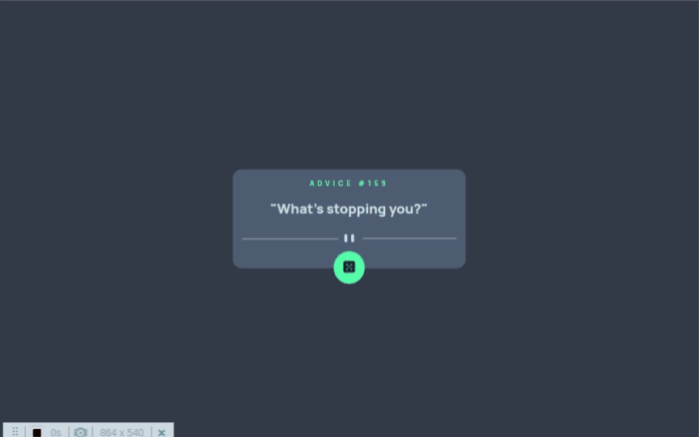
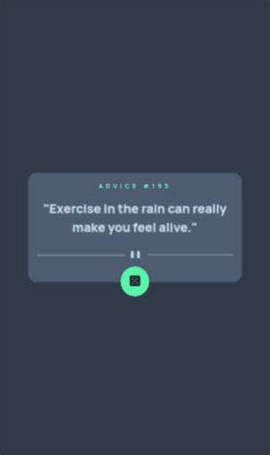
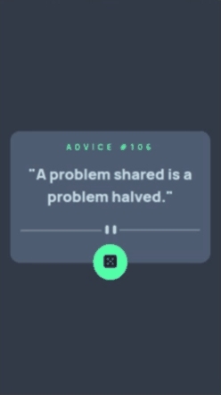

# Advice generator app

#### Advice generator app é um desafio do Frontend Mentor que consiste em um  aplicativo web simples para geração de conselhos aleatórios. O aplicativo utiliza tecnologias front-end e back-end para solicitar conselhos de uma API externa e exibi-los de forma interativa na página. Obrigado por conferir o meu cógigo.

## Índice

- [Captura de tela](#captura-de-tela)
- [Links](#links)
- [Construído com](#construído-com)
- [O que aprendi](#o-que-aprendi)
- [Desenvolvimento contínuo](#desenvolvimento-contínuo)
- [Recursos úteis](#recursos-úteis)
- [Fernando Mendes](#autor)

### Captura de tela

#### Tela Desktop



#### Tela Ipad



#### Tela Mobile



### Links

- Site URL: https://nandosti.github.io/advice-generator-app/

### Construído com

<div style="display: inline_block"><br>
  
  
         
</div>

## O que aprendi

Nesse projeto envolvendo HTML,CSS e JS, aprendi conceitos importantes: desenvolvimento frontend e backend; integração com API externa fazendo solicitações HTTP e recebendo dados JSON; função assíncrona; manipulação de elementos com o DOM; fet API; conceitos de estilização e responsividade. Uma novidade nos meus projetos foi o uso do conceito de "Mobile First".

## Trechos de códigos

```
JS

const fetchAdvice = async () => {
  const res = await fetch("https://api.adviceslip.com/advice")
  const data = await res.json()

  document.querySelector(".title").innerHTML = `Advice #${data.slip.id}`
  document.querySelector(".text").innerHTML = `"${data.slip.advice}"`
}

fetchAdvice()

```

## Desenvolvimento contínuo

Pretendo continuar focado em construir um conhecimento sólido nessas tecnologias. Ainda há muitos conceitos importantes para serem desenvolvidos. Todos os dias aprendo novos conceitos que são gradativamente adicionados ao meu repertório de ferramentas.

## Recursos úteis

- [W3School](https://www.w3schools.com/css/default.asp) - Esse site sempre me ajuda a resolver qualquer problema relacionados a códigos de uma maneira fácil e muito rápida.
- [Dev em Dobro](https://www.youtube.com/@DevemDobro) - Este é um canal onde encontro muito material. Tem muito conteúdo relacionado ao desenvolvimento. Recomendo a todos que querem aprender sobre esse e outros conceitos relacionados.

## Autor

[Fernando Mendes](https://www.linkedin.com/in/fernandomendesti/)
